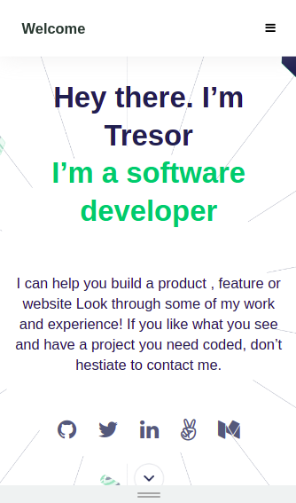
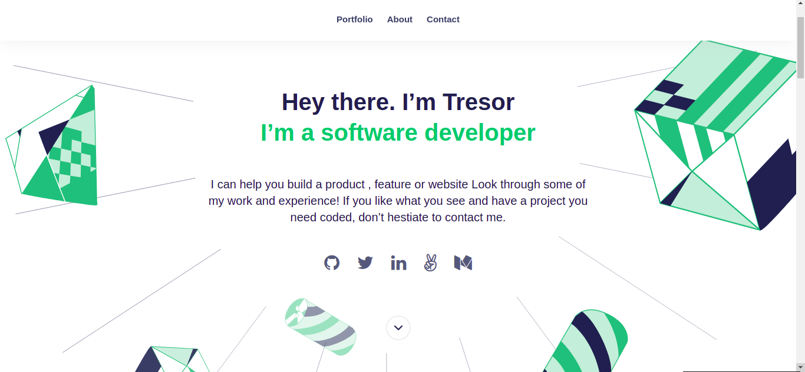

# Tresor's Portfolio

## Description

> This is my portfolio that describes me and what I can do like build products for the WEB, features, and websites look through some of my work and experience! If you like what you see and have a project you need to be coded, don’t hesitate to contact me.

## Here, are: 

Mobile version | Desktop
---------------------- | ------------------------------
 | 

## Built With

- HTML 
- CSS
- JavaScript

## Live Demo

[Live Demo Link](https://tresorsawasawa.github.io/MyPortfolio)

## Get Started

To get the content of this project locally you need to run the following commands in your terminal.

### Prerequisites
- IDE(code editor) like: **Vscode**, **Sublime**, etc. 
- [Git](https://www.linode.com/docs/guides/how-to-install-git-on-linux-mac-and-windows/)

### Setup
1. Download the **Zip** file or clone the repo with:
```bash
git clone https://github.com/tresorsawasawa/MyPortfolio.git
```
3. To access cloned directory run:
```bash
cd MyPortfolio
```
3. Open it with the live server

### Install
> To install linters and other project's dependencies run:
```bash
npm install
```
## Run Test for Linters

For tracking linter errors locally you need to follow these steps:

1. For tracking linter errors in HTML files run:
```bash 
npx hint .
```

2. For tracking linter errors in CSS or SASS files run:

```bash
npx stylelint "\*_/_.{css,scss}"
```

3. For tracking linter errors in JavaScript files run:

```bash
npx eslint .
```

## Authors

👤 **Tresor Sawasawa**

- GitHub: [@tresorsawasawa](https://github.com/tresorsawasawa)
- Twitter: [@tresorsawasawa](https://twitter.com/TresorSawasawa)
- LinkedIn: [Trésor Sawasawa](https://www.linkedin.com/in/tresor-sawasawa/)
  
👤 **Fatima Ezzahra**

- GitHub: [@TimmyChan99](https://github.com/TimmyChan99)
- Twitter: [@elemenoun](https://twitter.com/elemenoun)
- LinkedIn: [LinkedIn](https://www.linkedin.com/in/fatima-ezzahra-elemenoun-020841225/)


👤 **Josphat Nkonde**

- GitHub: [zairdon20](https://github.com/githubhandle)
- Twitter: [@Josphatnkonde1](https://twitter.com/twitterhandle)
- LinkedIn: [Josphat Nkonde](https://linkedin.com/in/linkedinhandle)

## 🤝 Contributing

- Contributions, issues, and feature requests are welcome!
- Feel free to check the [issues page](https://github.com/tresorsawasawa/MyPortfolio/issues).

## Show your support

Give a ⭐️ if you like this project!

## Acknowledgments

- Thank You [Microverse](www.microverse.org) team that help me with the template of this project.
- Thanks to everyone who will get time to check this code and suggest any [issue](https://github.com/tresorsawasawa/MyPortfolio/issues) to improve the page.

## 📝 License

This project is [MIT](./MIT.md) licensed.
